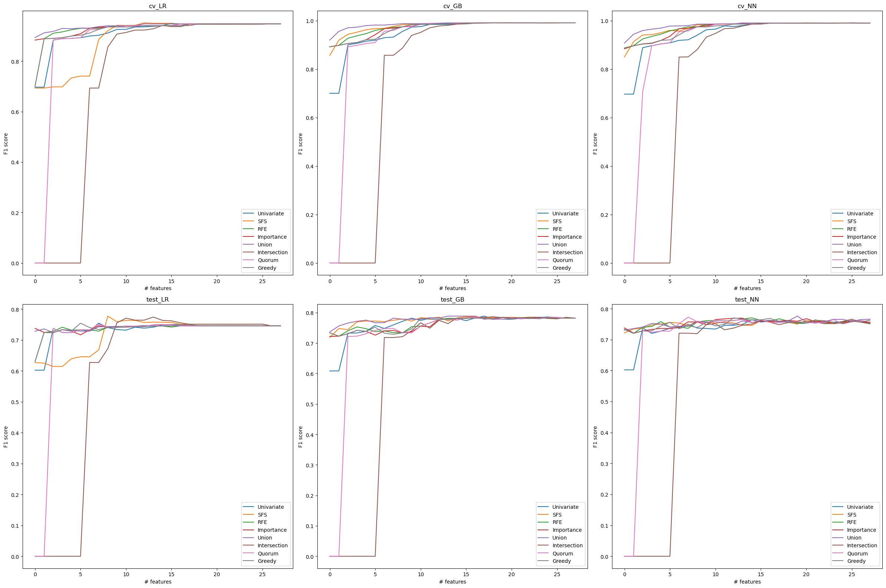
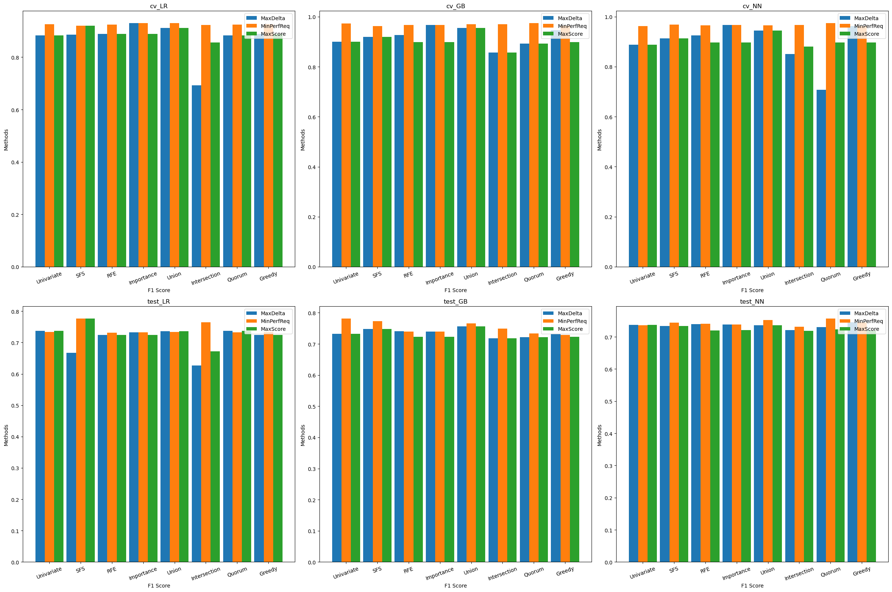
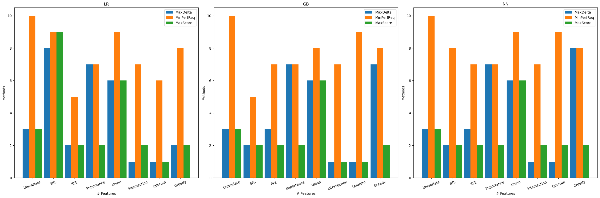
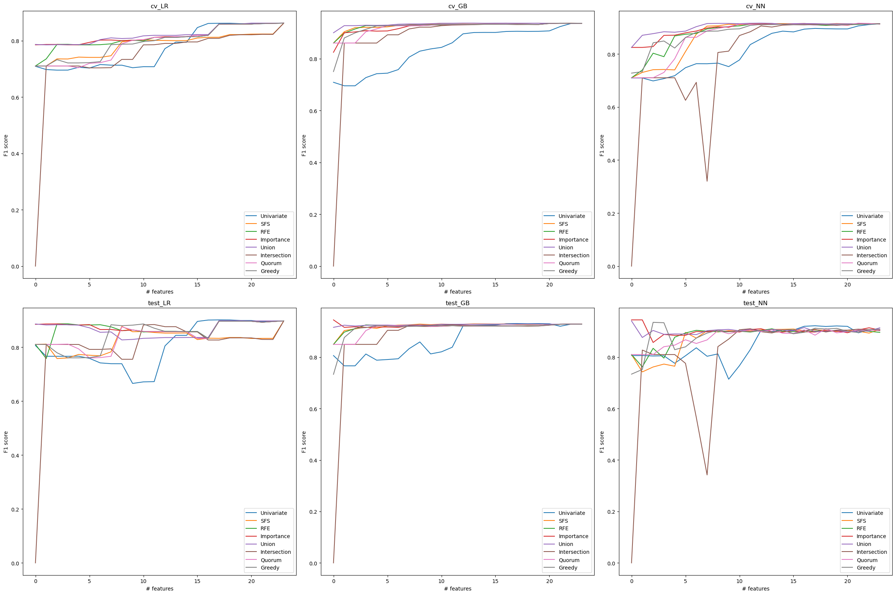
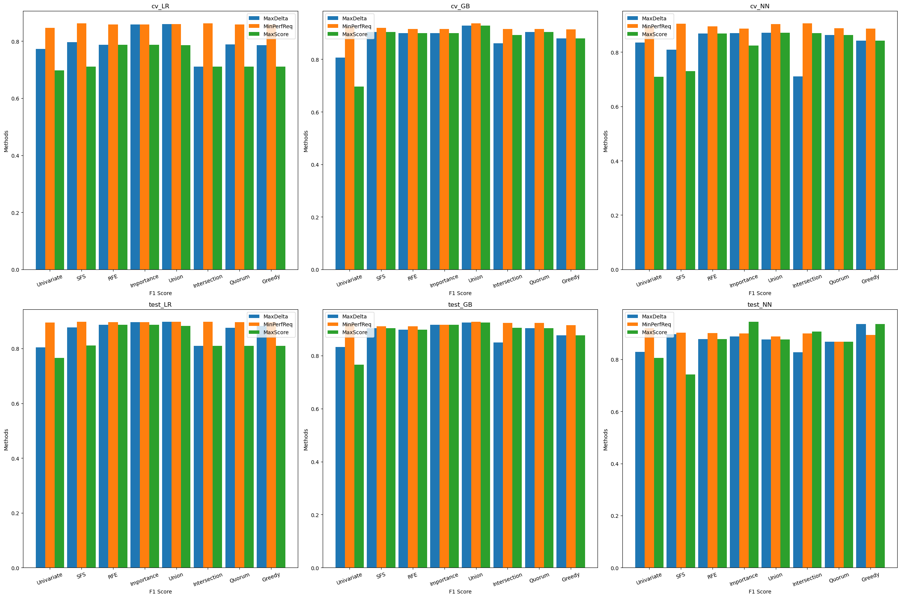
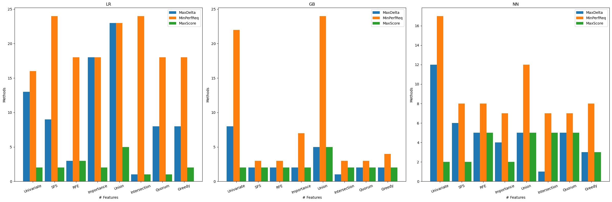
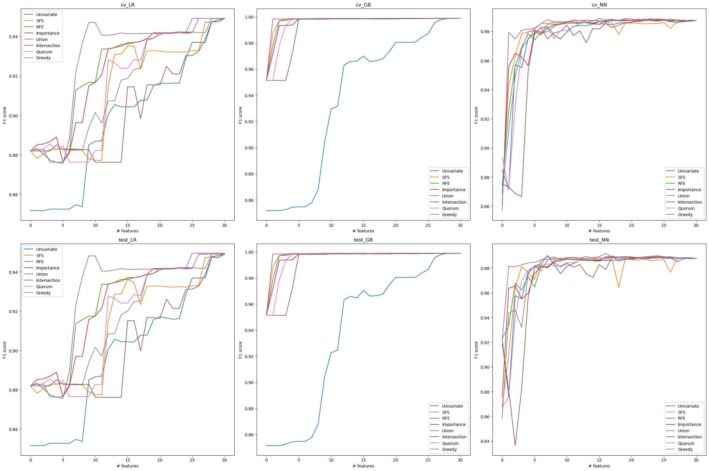
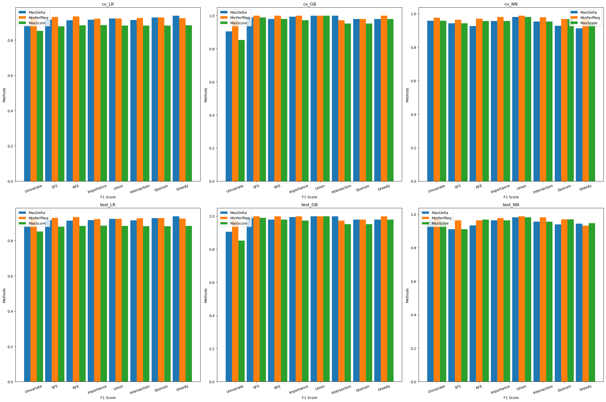
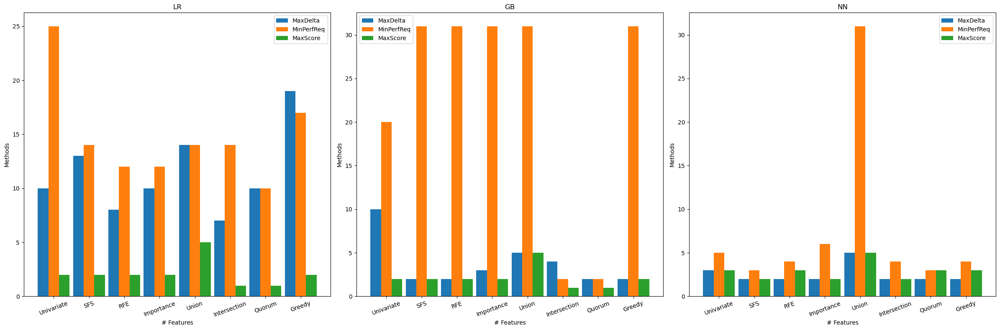

# Automatic-Feature-Selection
self implementation of paper Automated Feature Selection for Anomaly Detection in Network Traffic Data

# Experiment Settings
- random seed: 24
- Univariate: mutual information
- selection model: random forest (200 estimators)
- cross validation: 5-fold stratified seperation

# Experiment Results
## Time Cost
- correlation based
    - NSLKDD 6.4s
    - UNSW_NB15 7.6s
    - IDS2017 145.3s 
- Individual
    - Univariate
        - NSLKDD 17.5s
        - UNSW_NB15 9.1s
        - IDS2017 94.0s
    - SFS
        - NSLKDD 5289.2s
        - UNSW_NB15 3002.2s
        - IDS2017 35895.0s
    - RFE
        - NSLKDD 74.0s
        - UNSW_NB15 54.1s
        - IDS2017 564.1s
    - Importance
        - NSLKDD 3.3s
        - UNSW_NB15 2.5s
        - IDS2017 21.4s
- Set
    - NSLKDD 0.003s
    - UNSW_NB15 0.002s
    - IDS2017 0.002s
- Greedy:
    - NSLKDD 6748.8s
    - UNSW_NB15 4220.3s
    - IDS2017 50264.7s

## Performance
- NSLKDD

- UNSW_NB15

- IDS2017

